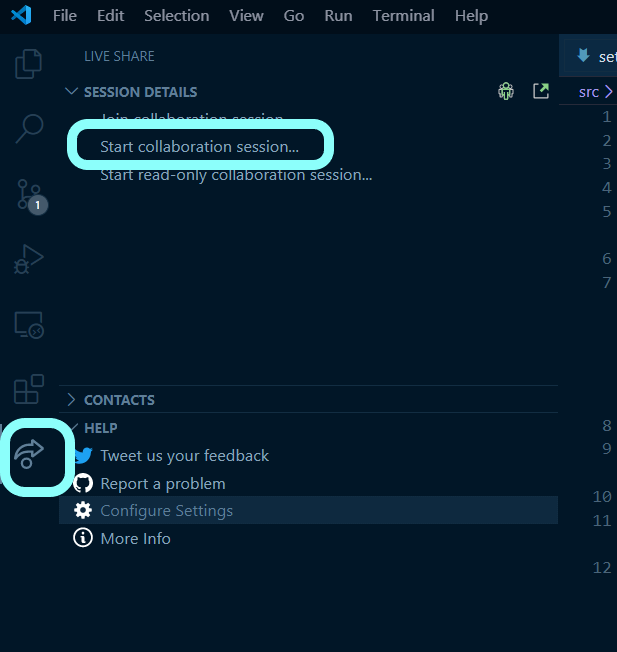
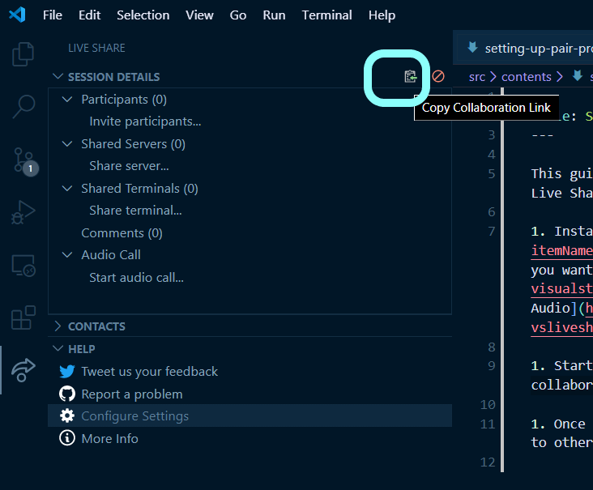

This guide shows you how to setup your VS Code to allows remote pair-programming with Live Share.

1. Install [Live Share Extension Pack](https://marketplace.visualstudio.com/items?itemName=MS-vsliveshare.vsliveshare-pack) which includes everything we need and more. If you want to install only what we need, install [Live Share](https://marketplace.visualstudio.com/items?itemName=ms-vsliveshare.vsliveshare) extension and [Live Share Audio](https://marketplace.visualstudio.com/items?itemName=ms-vsliveshare.vsliveshare-audio) (both are included in the Extension Pack).

1. Start a collaboration session by clicking "Live Share" Menu Button and then "Start collaboration session". If you're prompted to login, login with your GitHub account.

   

1. Once the session started, the session link will already be copied which you can share to others. You can always click the Copy Collaboration Link button again to get the link.

   

1. Start audio call by clicking "Start audio call".

   
